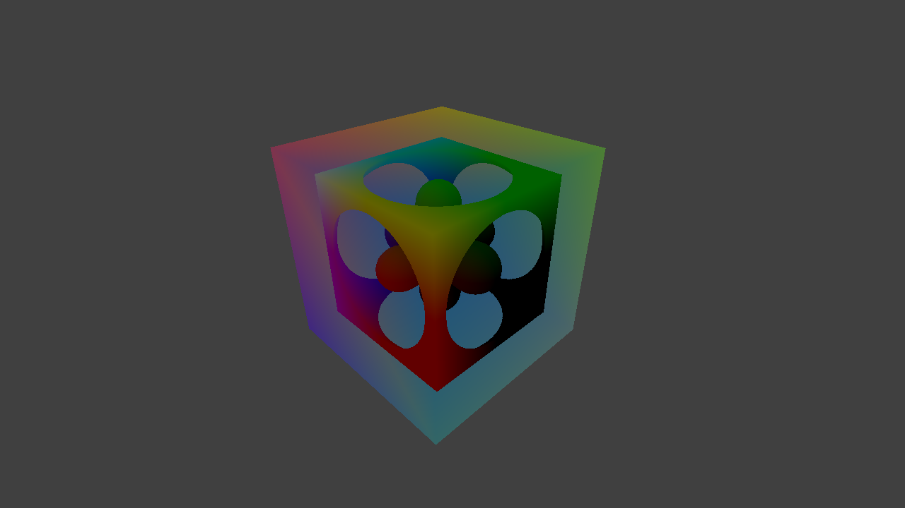
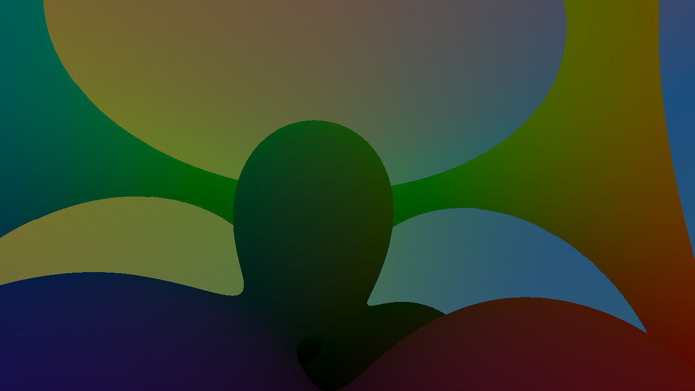

## Raymarching inside cube using a fragment shader
Fragment shader requires two important variables: `origin` and `direction`, which are given as interpolated values between vertices of the cube for any given pixel coordinate. Vertex shader calculates `origin` by transforming camera position into local space of the cube, like this:
```glsl
vec3 origin = inverseModel * vec4(cameraPosition, 1.0)
```
Because `origin` is positioned in local space of the cube, it becomes very simple to calculate direction of the ray, like this:
```glsl
vec3 direction = origin - vertexPosition;
```

Fragment shader normalizes interpolated `direction`, then goes into for-loop and advances the point on the ray starting from `origin` until it hits something or burns out of `MAX_STEPS`.

----

What's cool is that this approach makes it possible to render each cube with its own position, rotation and scale, this is because fragment shader operates inside clip-space. Another cool thing is that you can render inside and/or outside quads. This means that camera can get inside of a cube, but if we do not need that, we can draw less quads.

Note, that by default*, this technique does not work like a portal, so any sdf-primitive that sticks outside of the volume will look odd from a certain angle. To better understand what I mean, try replacing `evaluateScene` with this code and play with the camera:
```glsl
float evaluateScene (vec3 point)
{
	return sdSphere(point, vec3(0, 0, 1), 0.5);
}
```
This can be fixed by finding a point where the ray intersects with the ray. But we also want to account for cases, when the camera is inside the cube, so we're using max(0, nearest). This way, we will either go inside the cube, or the magnitude of the direction will equal zero:
```glsl
// By default, this line is commented out in the `main` procedure
point = point + direction * max(0, intersectAABB(point, direction, vec3(-0.5), vec3(+0.5)).x);
```

### References
Signed distance functions used in this code are copied from the website of Inigo Quilez: (https://iquilezles.org/articles/distfunctions)

----

[](https://www.buymeacoffee.com/kallisto56)